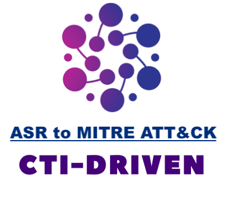
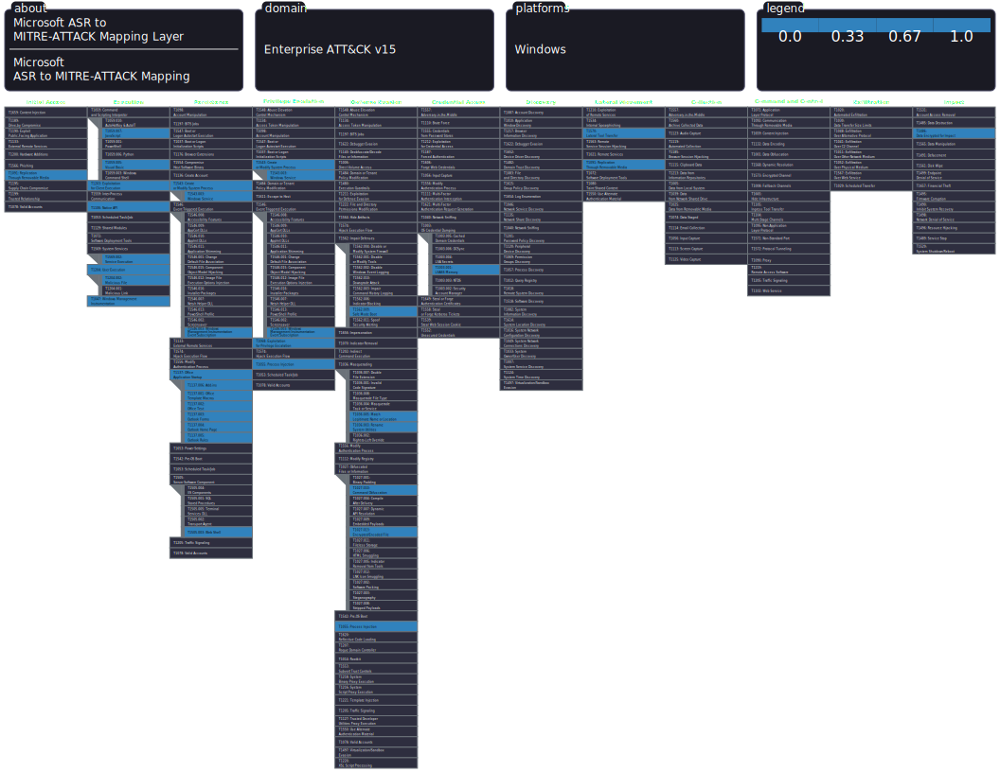

 

# Microsoft ASR to MITRE-ATTACK Mapping Project
**Description:**\
This project aims to bridge the gap between Microsoft Attack Surface Reduction (ASR) rules and MITRE ATT&CK by mapping ASR rules to their corresponding ATT&CK techniques. The primary goal is to enhance the understanding of how ASR rules align with the ATT&CK framework.
 

**Mapping Methodology:**\
The approach for mapping ASR (Attack Surface Reduction) rules to MITRE ATT&CK techniques draws inspiration from the following sources:

MITRE ATT&CK Enterprise Mitigations:
[ID: M1040](https://attack.mitre.org/mitigations/M1040/)
[ID: M1050](https://attack.mitre.org/mitigations/M1050/) \
Attack Control Framework Mappings: 
[Mapping Methodology](https://github.com/center-for-threat-informed-defense/attack-control-framework-mappings/blob/main/docs/mapping_methodology.md#)

##
**Last Updated:** Tue May 15 2024\
**ASR TO ATTACK:** [PDF](PDF_CSV_Files/ASRTOATTACKPDF.pdf) \
**ASR TO ATTACK:** [Google SpreadSheet Table](https://docs.google.com/spreadsheets/d/1OMsFsLsqoEXkZI4FjYm9Y2IzSBF6eAsT/edit?usp=sharing&ouid=118019733456378989878&rtpof=true&sd=true) \
**ASR TO ATTACK:** [STIX Visualizer](https://oasis-open.github.io/cti-stix-visualization/?url=https://raw.githubusercontent.com/CTI-Driven/Microsoft-ASR-to-MITRE-ATTACK-Mapping-Project/main/STIX2/ASR_ATTACK_STIX2.json) \
**Tidal Cyber Community Edition:** [Matrix](https://app.tidalcyber.com/share/d12b5a0d-a554-4782-b2d6-da5e5932600f) \
**References to Documentation for ASR rules:** [Microsoft ASR rules](https://learn.microsoft.com/en-us/defender-endpoint/attack-surface-reduction-rules-reference) 
# ASR Rules MITRE-ATTACK Navigator Coverage:

# Advanced hunting ASR Rules KQL:

| ASR Rules KQL Query | Technique IDs Mapping | Mapping types | Technique Names |
|---------------|-----------------------|---------------|-------------------------|
| [Block credential stealing from the Windows local security authority subsystem (lsass.exe)](ASR_Rules_KQL_Query/AsrLsassCredentialTheft-9e6c4e1f-7d60-472f-ba1a-a39ef669e4b2.md) | T1003.001 | mitigates | LSASS Memory |
| [Block execution of potentially obfuscated scripts](ASR_Rules_KQL_Query/AsrObfuscatedScript-5beb7efe-fd9a-4556-801d-275e5ffc04cc.md) | T1027.010, T1027.013 | mitigates | Command Obfuscation, Encrypted/Encoded File |
| [Block use of copied or impersonated system tools (preview)](ASR_Rules_KQL_Query/AsrUseOfCopiedorImpersonatedSystemtools-c0033c00-d16d-4114-a5a0-dc9b3a7d2ceb.md) | T1036.003, T1036.005 | mitigates | Rename System Utilities, Match Legitimate Name or Location |
| [Block process creations originating from PSExec and WMI commands](ASR_Rules_KQL_Query/AsrPsexecWmiChildProcess-d1e49aac-8f56-4280-b9ba-993a6d77406c.md) | T1047, T1569.002, T1570 | mitigates | Windows Management Instrumentation, Service Execution, Lateral Tool Transfer |
| [Block Office applications from injecting code into other processes](ASR_Rules_KQL_Query/AsrOfficeProcessInjection-75668c1f-73b5-4cf0-bb93-3ecf5cb7cc84.md) | T1055 | mitigates | Process Injection |
| [Block JavaScript or VBScript from launching downloaded executable content](ASR_Rules_KQL_Query/AsrScriptExecutableDownload-d3e037e1-3eb8-44c8-a917-57927947596d.md) | T1059.005, T1059.007 | mitigates | Visual Basic, JavaScript |
| [Block abuse of exploited vulnerable signed drivers](ASR_Rules_KQL_Query/AsrVulnerableSignedDriver-56a863a9-875e-4185-98a7-b882c64b5ce5.md) | T1068, T1543, T1543.003 | mitigates | Exploitation for Privilege Escalation, Create or Modify System Process, Windows Service |
| [Block untrusted and unsigned processes that run from USB](ASR_Rules_KQL_Query/AsrUntrustedUsbProcess-b2b3f03d-6a65-4f7b-a9c7-1c7ef74a9ba4.md) | T1091 | mitigates | Replication Through Removable Media |
| [Block Win32 API calls from Office macros](ASR_Rules_KQL_Query/AsrOfficeMacroWin32ApiCalls-92e97fa1-2edf-4476-bdd6-9dd0b4dddc7b.md) | T1106 | mitigates | Native API |
| [Block Office application from creating child processes](ASR_Rules_KQL_Query/AsrOfficeChildProcess-d4f940ab-401b-4efc-aadc-ad5f3c50688a.md) | T1137, T1137.001, T1137.002, T1137.003, T1137.004, T1137.005, T1137.006, T1204.002 | mitigates | Office Application Startup, Office Template Macros, Office Test, Outlook Forms, Outlook Home Page, Outlook Rules, Add-ins, Malicious File |
| [Block Office communication application from creating child processes](ASR_Rules_KQL_Query/AsrOfficeCommAppChildProcess-26190899-1602-49e8-8b27-eb1d0a1ce869.md) | T1137.005, T1203 | mitigates | Outlook Rules, Exploitation for Client Execution |
| [Block Office applications from creating executable content](ASR_Rules_KQL_Query/AsrExecutableOfficeContent-3b576869-a4ec-4529-8536-b80a7769e899.md) | T1137.006 | mitigates | Add-ins |
| [Block executable files from running unless they meet a prevalence, age, or trusted list criteria](ASR_Rules_KQL_Query/AsrUntrustedExecutable-01443614-cd74-433a-b99e-2ecdc07bfc25.md) | T1204 | mitigates | User Execution |
| [Block Adobe Reader from creating child processes](ASR_Rules_KQL_Query/AsrAdobeReaderChildProcess-7674ba52-37eb-4a4f-a9a1-f0f9a1619a2c.md) | T1204.002 | mitigates | Malicious File |
| [Block executable content from email client and webmail](ASR_Rules_KQL_Query/AsrExecutableEmailContent-be9ba2d9-53ea-4cdc-84e5-9b1eeee46550.md) | T1204.002 | mitigates | Malicious File |
| [Use advanced protection against ransomware](ASR_Rules_KQL_Query/AsrRansomware-c1db55ab-c21a-4637-bb3f-a12568109d35.md) | T1486 | mitigates | Data Encrypted for Impact |
| [Block Webshell creation for Servers](ASR_Rules_KQL_Query/AsrWebshellcreationforServers-a8f5898e-1dc8-49a9-9878-85004b8a61e6.md) | T1505.003 | mitigates | Web Shell |
| [Block persistence through WMI event subscription](ASR_Rules_KQL_Query/AsrPersistenceThroughWmi-e6db77e5-3df2-4cf1-b95a-636979351e5b.md) | T1546.003 | mitigates | Windows Management Instrumentation Event Subscription |
| [Block rebooting machine in Safe Mode (preview)](ASR_Rules_KQL_Query/AsrrebootingmachineinSafeMode-33ddedf1-c6e0-47cb-833e-de6133960387.md) | T1562.009 | mitigates | Safe Mode Boot |

## Useful Use Cases of the Microsoft ASR to MITRE-ATT&CK Mapping Project:

1. **Heatmap Generation for Coverage Analysis**:
   - **Description**: Utilize the [ASR to ATT&CK Navigator Coverage](Mitre%20attack%20navigator/microsoft_asr_to_mitre-attack_mapping_layer.json) alongside the ATT&CK Navigator for the specific threats you are concerned about (e.g., the top 20 techniques used by ransomware groups).
   - **Benefit**: This allows you to generate a heatmap that visualizes the coverage provided by existing [Microsoft ASR rules](https://learn.microsoft.com/en-us/defender-endpoint/attack-surface-reduction-rules-reference). By identifying the techniques already mitigated by ASR rules, you can prioritize efforts on techniques that are not yet covered.

2. **Integration with Threat Intelligence Platforms (TIPs)**:
   - **Description**: Streamline the [ASR to ATT&CK Navigator Coverage](Mitre%20attack%20navigator/microsoft_asr_to_mitre-attack_mapping_layer.json) or [ASR_STIX2](STIX2/ASR_ATTACK_STIX2.json) files into your Threat Intelligence Platforms (TIPs) such as TidalCyber, OpenCTI, MISP, etc.
   - **Benefit**: Integrating these files into your TIPs allows for enhanced threat intelligence analysis and pivoting. It also enables you to see how the user-defined mitigation scores are upgraded when ASR rules are applied, providing a clear view of the improvements in your security posture.

## Author:
Linkedin : [Nounou Mbeiri](https://www.linkedin.com/in/nounou-mbeiri) \
Twitter : [@Nounou Mbeiri](https://twitter.com/Nounou_Mbeiri)
